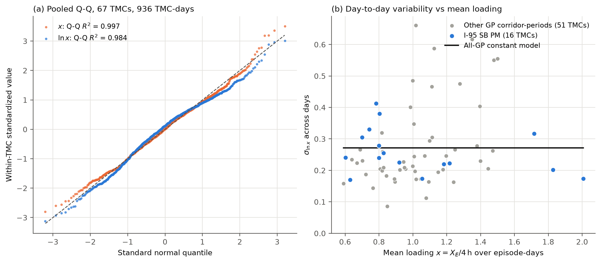
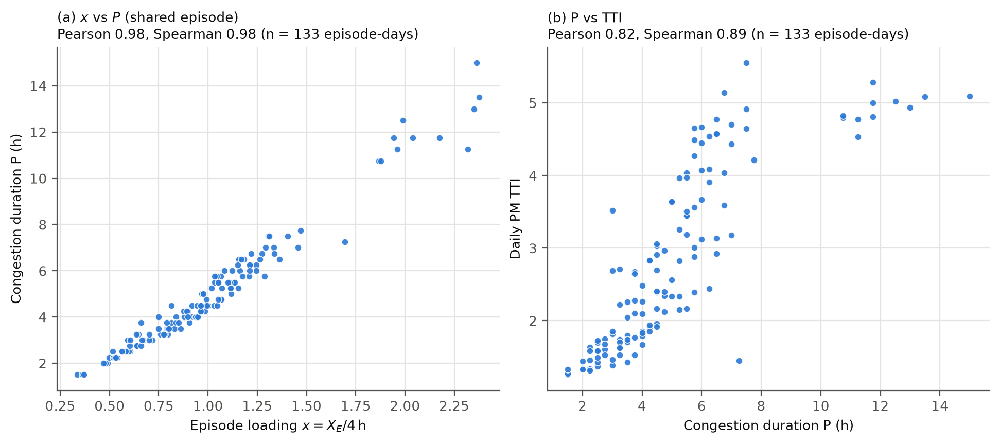
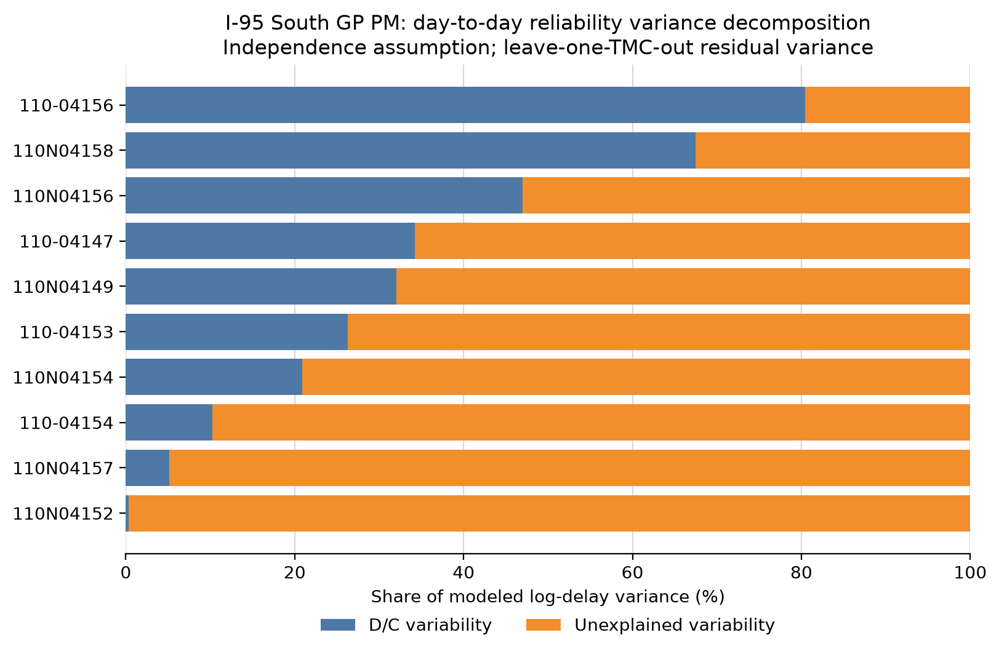
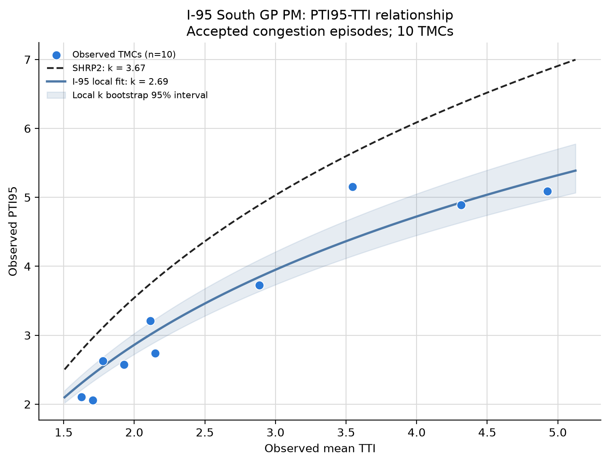

# QVDF Reliability Evidence for NVTA: I-95

This branch tests the QVDF reliability chain on Northern Virginia data. The
PeMS prototype is on
[`main`](https://github.com/jacky850/i405-qvdf-reliability-experiments).

In the chain under test, one stochastic loading ratio $`X`$ with
$`\ln X\sim N(\mu_X,\sigma_X^2)`$ drives both QVDF branches:

```math
P=f_dX^n\ \ [\mathrm{h}],\qquad T=T_0\left(1+\alpha X^\beta\right)\ \ [\mathrm{min/trip}].
```

Congestion duration $`P`$, mean travel time $`E[T]`$ and planning time $`T_{95}`$
are therefore different quantities driven by one mechanism. With
$`\mathrm{TTI}=E[T]/T_0`$ and $`\mathrm{PTI}_{95}=T_{95}/T_0`$,

```math
\mathrm{PTI}_{95}=1+\alpha e^{\beta\mu_X+1.645\,\beta\sigma_X},\qquad
\gamma_{95}=\frac{\mathrm{PTI}_{95}}{\mathrm{TTI}}.
```

## Data

- **RITIS/INRIX TMC export**: 5-minute speed, reference speed and travel
  time for 23 weekdays in October 2025.
- **NVTA CBI calibration package**: per-TMC QVDF parameters
  $`(f_d,n,\alpha,\beta)`$, and the accepted daily congestion episodes with
  $`P`$ and loading.
- **Cube 2025 AM network**: lanes, capacity, and period closure codes
  (`AMLIMIT`, `PMLIMIT`).

The RITIS data are licensed and are not redistributed.

**Loading measures.** Neither source has vehicle counts, so flow $`q(t)`$ is
reconstructed from RITIS speed with the inverse S3 speed–flow model. Two
loading measures are used:

- **A1 and A2** use the capacity-equivalent congested-flow duration
  $`X_E=\int_Eq(t)\,dt\,/\,C`$, where $`E`$ is the congestion episode and $`C`$ is
  hourly capacity (veh/h). $`X_E`$ is in hours, so $`f_d`$ has units
  $`\mathrm{h}^{1-n}`$.
- **B and C1–C5** use the CBI package's episode loading
  $`x=X_E/4\,\mathrm{h}`$: vehicles per lane over the episode divided by
  2,000 veh/h/lane × 4 h of PM capacity. For example, 4,193 veh/lane in a
  2.5-hour episode gives $`X_E=2.10`$ h and $`x=0.52`$.

Both measures accumulate flow over the same episode that defines $`P`$, and
both exist only on days with an accepted congestion episode. Neither is the
peak-hour $`D/C`$ of a planning model.

## Experiments

| ID | Question | Corridor, period | Sample |
|---|---|---|---|
| A1 | Does the threshold near $`v_c`$ change $`f_d`$, $`n`$? | I-95 NB GP, AM | 20 TMCs, 275 TMC-days |
| A2 | How much does the cutoff $`0.50v_f\to0.25v_f`$ change B1? | I-95 NB GP, AM | 20 TMCs, 460 TMC-days |
| B | What is the day-to-day distribution of $`x`$? | 6 GP corridor-periods on I-95 and I-395 | 67 TMCs with ≥ 8 episode-days, 936 TMC-days |
| C1–C2 | Do $`x`$, $`P`$, TTI and $`\mathrm{PTI}_{95}`$ move together? | I-95 SB GP, PM | 10 TMCs, 133 episode-days |
| C3 | Does stochastic $`x`$ reproduce observed TTI and $`\mathrm{PTI}_{95}`$? | same | same |
| C4 | How much travel-time variability does $`x`$ explain? | same | same |
| C5 | Does the SHRP2 PTI–TTI relation hold? | same | same |
| C6 | Can managed-lane reliability credit be derived from its own loading and QVDF? | I-95 and I-395 express lanes, open direction | 4 corridor-periods, 23 weekdays |

I-95 SB has 24 GP TMCs (23.0 mi). C1–C5 use the 10 TMCs (10.2 mi) that
have their own QVDF parameters passing the CBI quality screen and at least
3 accepted PM episode-days. All C1–C5 results are conditional on accepted
congestion episodes.

## A1. Threshold sensitivity near the speed at capacity

RITIS speed on I-95 NB, weekdays 05:00–10:00, 15-minute bins. For each TMC,
$`v_f`$ is the weekday off-peak (21:00–05:00) speed P85, $`v_c=v_f/\sqrt2`$, and
$`C`$ is the Cube AM link capacity. Episodes are detected at thresholds
$`a\,v_c`$ with $`a`$ from 0.90 to 1.10. At each threshold, $`P`$ and $`X_E`$ are
recomputed and $`P=f_dX_E^{\,n}`$ is refitted on the same 275 TMC-days.


| Threshold / $`v_c`$ | Median $`P`$ (h) | Median $`X_E`$ (h) | $`f_d`$ ($`\mathrm{h}^{1-n}`$) | $`n`$ | $`R^2`$ |
|---:|---:|---:|---:|---:|---:|
| 0.90 | 2.08 | 1.76 | 1.223 | 0.943 | 0.948 |
| 0.95 | 2.30 | 1.96 | 1.228 | 0.928 | 0.948 |
| 1.00 | 2.50 | 2.13 | 1.165 | 0.972 | 0.959 |
| 1.05 | 2.72 | 2.35 | 1.163 | 0.972 | 0.955 |
| 1.10 | 2.97 | 2.61 | 1.151 | 0.979 | 0.966 |

$`P`$ and $`X_E`$ both grow with the threshold. Relative to $`1.00v_c`$, $`f_d`$
changes by at most 5.4% and $`n`$ by at most 4.5%. The duration structure is
stable near $`v_c`$. $`P`$ and $`X_E`$ share the episode, so this is an
internal-consistency check, not independent validation. A fit on the
dimensionless peak-hour basis $`D^{60}/C`$ (A3) was run on PeMS data and is
reported on `main`.

## A2. Policy cutoff: $`0.50v_f`$ vs $`0.25v_f`$

Same data and episode rule as A1. The severe-congestion cutoff is $`r\,v_f`$
with $`r\in\{0.50,0.25\}`$. The daily B1 measure is $`\sum_sP_{s,d}L_s`$ in
congested link-mile-hours.

| Facility | Cutoff | Qualifying TMC-days | Mean daily link-mile-hours |
|---|---:|---:|---:|
| GP | $`0.50v_f`$ | 201 of 460 | 13.63 |
| GP | $`0.25v_f`$ | 43 of 460 | 1.54 |

Moving to $`0.25v_f`$ removes 88.7% of congested link-mile-hours and 79% of
qualifying TMC-days. The duration model is stable near $`v_c`$ (A1), but the
policy cutoff largely determines the B1 score.

## B. Day-to-day distribution of the loading

Every GP TMC with at least 8 accepted episode-days in six corridor-periods
is used. For each TMC, the across-day mean $`\mu`$ and standard deviation
$`\sigma`$ of $`\ln x`$ are computed. Normality is checked with Q-Q plots, and
AICc compares a constant $`\sigma`$ with $`\sigma`$ linear in mean $`x`$. Panel (a)
pools all TMC-days after standardizing within each TMC.



| Corridor-period | TMCs | TMC-days | Median $`\sigma_{\ln x}`$ |
|---|---:|---:|---:|
| I-95 SB PM | 16 | 213 | 0.24 |
| I-95 NB AM | 10 | 155 | 0.26 |
| I-95 NB PM | 9 | 97 | 0.55 |
| I-395 NB AM | 12 | 173 | 0.20 |
| I-395 NB PM | 9 | 122 | 0.21 |
| I-395 SB PM | 11 | 176 | 0.19 |

A lognormal $`x`$ is not rejected, but a normal $`x`$ fits equally well. The
pooled Q-Q $`R^2`$ is 0.984 for $`\ln x`$ and 0.997 for $`x`$, and $`\ln x`$ is
left-skewed on 75% of TMCs. With $`\sigma\approx0.25`$ the two shapes differ
little, so the lognormal formulas remain a usable approximation. $`\sigma`$
shows no trend with mean loading (the constant model is selected), but it
varies widely between TMCs, from 0.09 to 0.66 (interquartile range
0.20–0.31). These statistics cover congested days only; including
uncongested days would widen the distribution.

## C1–C2. Do the quantities move together?

C1 correlates $`x`$, $`P`$, and the day's 15:00–19:00 TTI from RITIS travel time
across 133 episode-days. C2 aggregates each of the 10 TMCs over its
weekdays. Intervals come from 2,000 bootstrap resamples.



| Level | Pair | n | Pearson | Spearman (95% CI) |
|---|---|---:|---:|---:|
| C1 | $`x`$ vs $`P`$ | 133 days | 0.98 | 0.98 (0.97–0.99) |
| C1 | $`x`$ vs TTI | 133 days | 0.76 | 0.81 (0.72–0.88) |
| C1 | $`P`$ vs TTI | 133 days | 0.82 | 0.89 (0.81–0.94) |
| C2 | $`E[P]`$ vs TTI | 10 TMCs | 0.92 | 0.87 (0.41–1.00) |
| C2 | $`P_{95}`$ vs $`\mathrm{PTI}_{95}`$ | 10 TMCs | 0.81 | 0.90 (0.59–1.00) |
| C2 | TTI vs $`\mathrm{PTI}_{95}`$ | 10 TMCs | 0.94 | 0.93 (0.65–1.00) |

All pairs are positive and strong, and rankings agree at both levels. The
0.98 for $`x`$ vs $`P`$ is largely mechanical, because both come from the same
episode and the same RITIS speeds. The independent evidence is $`x`$ and $`P`$
against TTI and $`\mathrm{PTI}_{95}`$, which use RITIS travel time. The C2
intervals are wide because there are only 10 TMCs.

## C3. Observed vs QVDF-implied reliability

For each of the 10 TMCs, two values of each metric are computed:

- **Model**: $`\mu_x`$ and $`\sigma_x`$ come from the TMC's accepted
  episode-days. With the TMC's calibrated $`(\alpha,\beta)`$, the lognormal
  formulas give model TTI, $`\mathrm{PTI}_{95}`$ and $`\gamma_{95}`$.
- **Observed**: from the TMC's daily PM TTI (RITIS travel time), TTI is the
  mean over days, $`\mathrm{PTI}_{95}`$ the 95th percentile, and $`\gamma_{95}`$
  their ratio.

Each metric therefore has 10 (observed, model) pairs, one per TMC. The table
compares these pairs. Pearson $`r`$ measures linear agreement between the
observed and model values. Spearman $`\rho`$ measures whether the model ranks
the 10 TMCs in the same order as the observations. MAE is the mean of
$`|\text{model}-\text{observed}|`$, and bias is the mean of
$`\text{model}-\text{observed}`$.

| Metric (observed vs model, 10 TMCs) | Pearson $`r`$ | Spearman $`\rho`$ | MAE | Bias |
|---|---:|---:|---:|---:|
| TTI | 0.96 | 0.94 | 0.86 | −0.86 |
| $`\mathrm{PTI}_{95}`$ | 0.86 | 0.78 | 1.23 | −1.23 |
| $`\gamma_{95}`$ | 0.47 | 0.44 | 0.14 | −0.10 |

TMCs that are less reliable in the observations are also less reliable in the
model: the rank agreement is 0.94 for TTI and 0.78 for $`\mathrm{PTI}_{95}`$.
However, the model value is lower than the observed value on all 10 TMCs, by
0.86 for TTI and 1.23 for $`\mathrm{PTI}_{95}`$ on average. For $`\gamma_{95}`$
the rank agreement is weak (0.44). The variation in $`x`$ alone does not produce
enough travel-time spread.

## C4. How much variability does the loading explain?

The daily log delay is split as
$`\ln(\mathrm{TTI}-1)=\ln\alpha+\beta\ln x+\varepsilon`$. For each TMC,
$`\beta^2\sigma_x^2`$ is the loading-driven variance and $`\tau^2`$ is the
variance of the residual $`\varepsilon`$. $`\tau`$ is estimated leave-one-TMC-out:
each TMC's $`\tau`$ comes only from the other nine TMCs, so no TMC corrects
itself. Adding $`\tau`$ while keeping the mean delay unchanged gives

```math
\mathrm{PTI}_{95}=1+\alpha\exp\left(\beta\mu_x-\tfrac12\tau^2+1.645\sqrt{\beta^2\sigma_x^2+\tau^2}\right).
```



| Model $`\mathrm{PTI}_{95}`$ | Pearson | Spearman | MAE | Bias |
|---|---:|---:|---:|---:|
| Loading variability only (C3) | 0.86 | 0.78 | 1.23 | −1.23 |
| Loading variability + $`\tau`$ | 0.95 | 0.84 | 0.82 | −0.82 |

On the median TMC, day-to-day loading explains 29.1% of log-delay variance.
The other 70.9% is residual: incidents, weather, work zones and other
nonrecurring causes. The loading share ranges from 0.4% to 80.5% across
TMCs. Adding $`\tau`$ cuts the $`\mathrm{PTI}_{95}`$ error by a third and
improves the ranking, but the model still underpredicts.

## C5. PTI–TTI relationship vs SHRP2

$`\mathrm{PTI}_{95}=1+k\ln\mathrm{TTI}`$ is fitted to the 10 TMCs and compared
with the SHRP2 L03 value $`k=3.67`$. The local $`k`$ is scored
leave-one-TMC-out: each TMC is predicted with the $`k`$ fitted to the other
nine.



TTI and $`\mathrm{PTI}_{95}`$ are strongly related (Spearman 0.93), so the
functional form works. The local fit gives $`k=2.69`$ (95% CI 2.49–2.92),
which excludes 3.67. SHRP2 overpredicts all 10 TMCs (MAE 0.94, bias +0.94),
while the local $`k`$ gives MAE 0.28, 71% lower. Over 81 GP TMCs in four
corridor-periods (C6 sample, all weekdays), $`k=2.97`$ (2.83–3.10), also below
3.67.

## C6. Managed-lane reliability credit — not feasible with current data

**Intended.** Derive managed-lane TTI and PTI95 from the lane's own loading
distribution and QVDF, as in C3, then compute a project's planning-time saving
$`\Delta T_{95}=T_{95}^{\mathrm{NoBuild}}-T_{95}^{\mathrm{Build}}`$.

**Why it cannot be done.**

1. *No loading distribution.* The I-95 and I-395 express lanes are reversible
   (northbound AM, southbound PM). In the open direction they almost never
   congest: accepted episode TMC-days are 0 of 460 on I-95 SB PM, 1 of 460 on
   I-95 NB AM, 0 of 506 on I-395 SB PM and 9 of 506 on I-395 NB AM. Without
   episodes, $`x`$ and $`\sigma_x`$ are undefined.
2. *No QVDF parameters.* For the same reason, no managed-lane
   $`(f_d,n,\alpha,\beta)`$ can be calibrated in the open direction. The
   existing CBI managed-lane fits come from closed-direction records (RITIS
   still reports about 0.70 of reference speed while a lane is closed) and are
   rejected.
3. *No Build scenario.* A project saving needs Build and No-Build loadings
   from a model run, which is not available.

**Substitute.** Observed travel times on matched GP and managed-lane sections,
open direction, 23 weekdays:

| Corridor-period | Section (mi) | TTI GP / ML | PTI95 GP / ML | GP − ML planning time (min/trip) |
|---|---:|---:|---:|---:|
| I-95 SB PM | 23.6 | 2.12 / 1.01 | 2.55 / 1.01 | 36.2 |
| I-95 NB AM | 23.6 | 1.53 / 1.01 | 2.02 / 1.09 | 23.2 |
| I-395 SB PM | 9.6 | 1.85 / 0.98 | 2.38 / 0.99 | 14.2 |
| I-395 NB AM | 9.5 | 1.79 / 1.02 | 2.21 / 1.10 | 12.0 |

The open managed lane runs at free flow. This is the observed GP–managed-lane
difference for current users. It is not a QVDF-derived managed-lane
reliability, not a Build-versus-No-Build benefit, and not a causal credit.

## Answers

**1. Is one PTI–TTI relationship transferable across facility types and
geographies?** Not as a single constant. Within I-95 GP the form
$`\mathrm{PTI}_{95}=1+k\ln\mathrm{TTI}`$ fits well, but $`k`$ is 2.7–3.0, not
SHRP2's 3.67, which overpredicts every TMC (C5). It does not carry across
lane types: open managed lanes sit at $`\gamma_{95}\approx1.0`$ and GP at
1.2–1.3 (C6). Most travel-time variability is nonrecurring (C4), and its
size by facility group is not yet estimated. Geographic transfer is
untested, because all data are from Northern Virginia.

**2. Should B1 count planning-time savings instead of congested duration?**
The data favor planning time. Duration and planning time rank links the same
way ($`P_{95}`$ vs $`\mathrm{PTI}_{95}`$ Spearman 0.90, C2), but duration depends
on an arbitrary cutoff: −88.7% from $`0.50v_f`$ to $`0.25v_f`$ (A2). Planning time
needs no threshold and includes the 71% of variability that loading does not
explain (C4). Two conditions apply. The QVDF underpredicts
$`\mathrm{PTI}_{95}`$ unless a nonrecurring term $`\tau`$ is added (C3, C4).
Summed link planning time is an exposure proxy, not route planning time.

**3. How should managed lanes receive reliability credit?** Not yet through
the QVDF chain. In their open direction the express lanes have no congestion
episodes, so there is no loading distribution and no usable QVDF parameters
(C6). Observed data show the open lane at free flow, with 12–36 min/trip less
planning time than the parallel GP lanes. Credit for a project requires
Build and No-Build loadings from a model run, and a managed-lane delay
function calibrated in the open direction.

**4. Test all four options, or narrow first?** Narrow first. The threshold
near $`v_c`$ is settled (A1). The policy cutoff (A2), and whether PTI screens
links or becomes the measure (Question 2), change scores materially and
should be decided before broader testing. Facility-class and geographic
transferability cannot be answered from one region and should follow.

## Reproduce

The RITIS export, CBI package and Cube network are not included. Set their
locations in `config/nvta_*.json` (A1, A2) and with `NVTA_EXTERNAL_ROOT`
(B, C3–C6), then run:

```bash
python scripts/audit_nvta_i95_parameters.py
python scripts/run_nvta_experiment_a.py --config config/nvta_experiment_a_i95_nb_am_empirical.json
python scripts/run_nvta_b1_speed_cutoff.py
python nvta/c3-qvdf-reliability/run_nvta_c3.py
python nvta/b-dc-variability/run_nvta_b.py
python nvta/c4-variability-decomposition/run_nvta_c4.py
python nvta/c5-pti-tti-comparison/run_nvta_c5.py
python nvta/c6-managed-lane-comparison/run_nvta_c6.py
python nvta/core_evidence.py
```
