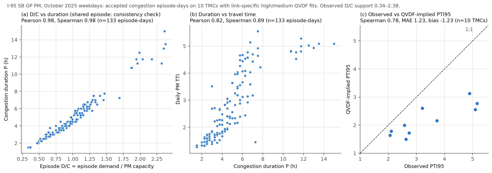
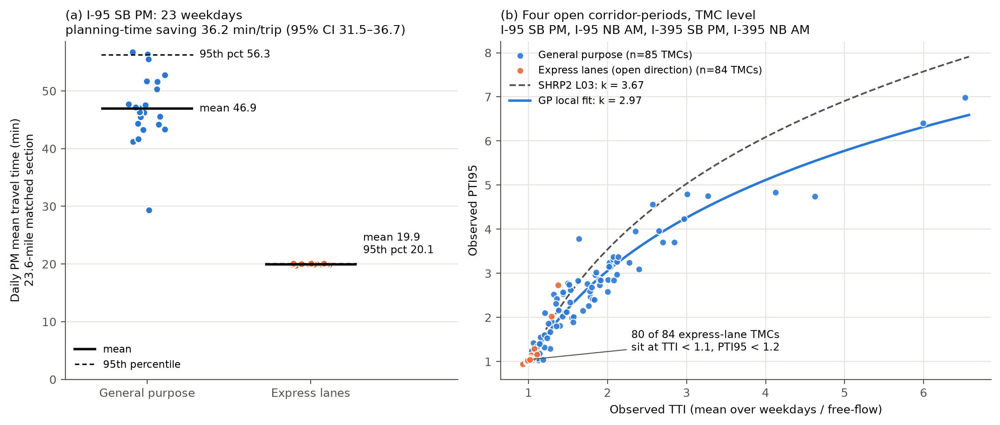

# QVDF Reliability Experiments: PeMS I-405 and NVTA I-95

This repository answers the September 22, 2026 memo on QVDF reliability for
the NVTA B1 measure. It makes one claim:

> Congestion duration $P$ (h), mean travel time $E[T]$ and planning time
> $T_{95}$ (min per trip) are different measures in different units. On I-95
> they move together, consistently with one stochastic loading ratio
> $X=D/C$, but day-to-day $D/C$ explains only about 29% of travel-time
> variability. The rest belongs in a nonrecurring term $\tau_g$.

The prototype is PeMS I-405 South (Experiments A and B). The evidence for
NVTA uses RITIS/INRIX travel times and the calibrated NVTA QVDF package for
I-95 and I-395 (October 2025, 23 weekdays).

## Answers to the memo

| # | Question | Answer | Evidence |
|---|---|---|---|
| 1 | Does the speed threshold change $P$, $D/C$, $f_d$, $n$? | Near $v_c$, barely. Across $0.90$–$1.10\,v_c$, $f_d$ moves ≤ 5.4% and $n$ ≤ 4.5% on I-95 NB GP ($R^2$ 0.95–0.97, 275 TMC-days). The NVTA policy cutoff matters a lot: moving from $0.50v_f$ to $0.25v_f$ removes **88.7%** of congested link-mile-hours (203 → 43 TMC-days). | A1: [doc 05](docs/05_nvta_experiment_a_i95_nb_am_empirical_parameters.md); A2: [doc 06](docs/06_nvta_b1_speed_cutoff_test.md) |
| 2 | Can stochastic $D/C$ give TTI, PTI95 and reliability? | Yes in rank: QVDF-implied vs observed PTI95 Spearman **0.78** (10 TMCs). Not in level: the model underpredicts PTI95 by **1.23** points on average. | C3 |
| 3 | How much variability does $D/C$ explain? | Median **29.1%** of day-to-day log-delay variance; **70.9%** is residual. Adding a leave-one-TMC-out residual term $\tau$ cuts PTI95 MAE from 1.23 to **0.82**. | C4 |
| 4 | Does the PTI–TTI relationship transfer? | Strong within I-95 (TTI–PTI95 Spearman 0.93), but SHRP2's $k=3.67$ is outside the local interval: $k=$ **2.69** (2.49–2.92) on the C3 sample and **2.97** (2.83–3.10) on 81 GP TMCs over four corridor-periods. It does not transfer across lane types: open managed lanes sit at $\gamma_{95}\approx1.02$. | C5, C6 |
| 5 | How should managed lanes get credit? | By their own observed travel-time distribution in the open direction. On I-95 SB PM the express lanes save **36.2 min/trip** of planning time (23.6 mi; TTI 1.01 vs 2.12). There are **no usable QVDF parameters** for an open managed lane. | C6: [doc 08](docs/08_managed_lane_comparison.md) |

Every number above is in [`key_results/key_numbers.csv`](key_results/key_numbers.csv).

## Core evidence

### Figure 1: D/C, duration, travel time and planning time move together



**Table 1. C1/C2 correlations**, I-95 SB GP PM. C1 uses 133 accepted
episode-days and C2 uses 10 TMCs across their weekdays. Intervals are
2,000-replicate bootstrap 95% intervals.

| Level | Pair | Pearson | Spearman (95% CI) |
|---|---|---:|---:|
| C1 link-day | D/C vs P ¹ | 0.98 | 0.98 (0.97–0.99) |
| C1 link-day | D/C vs TTI | 0.76 | 0.81 (0.72–0.88) |
| C1 link-day | P vs TTI | 0.82 | 0.89 (0.81–0.94) |
| C2 TMC | E[P] vs TTI | 0.92 | 0.87 (0.41–1.00) |
| C2 TMC | P95 vs PTI95 | 0.81 | 0.90 (0.59–1.00) |
| C2 TMC | TTI vs PTI95 | 0.94 | 0.93 (0.65–1.00) |

¹ The NVTA $D/C$ is episode demand over PM-period capacity, reconstructed from
the same RITIS speeds. It shares the episode with $P$, so 0.98 is an
internal-consistency check (memo Section 5), not independent validation. The
memo's matched peak-hour $D^{60}/C$ needs model or detector volumes that the
RITIS data do not provide.

### Figure 2: most day-to-day variability is not D/C (C4)


The $D/C$ share ranges from about 0% to 80% across the 10 TMCs. This is the
$\beta^2\sigma^2_{\ln(D/C)}$ versus $\tau^2_g$ split of memo Section 3.

### Figure 3: local PTI–TTI curve vs SHRP2 (C5)


SHRP2 overpredicts PTI95 on all 10 TMCs (MAE 0.94). A leave-one-TMC-out
local $k$ has MAE 0.28.

### Figure 4: GP vs managed lane in the open direction (C6)



The express lanes are reversible: northbound in AM, southbound in PM. The
existing managed-lane QVDF fits (12 TMCs on I-95 HOV NB PM, 13 on I-395 HOV
NB PM) come from **closed-direction** records, where the speed ratio is about
0.70 while the lane is closed. They are excluded. See
[doc 08](docs/08_managed_lane_comparison.md) for the audit and all four
corridor-periods.

## Scope and caveats

- C3–C5 are **conditional on accepted PM congestion episodes** on 10 TMCs of
  one corridor, direction and period. They are descriptive, not national
  transferability evidence.
- Link 95th percentiles do not add to a route 95th percentile. Summed link
  planning time is a *planning-time exposure proxy*. C6 section values are
  sums of simultaneous TMC travel times, not trajectory times.
- The C6 managed-lane savings are the reliability a traveler already in the
  lane enjoys. The memo's build-versus-no-build express-lane test, and any
  toll or lane-choice valuation, are not done.
- PeMS Experiment B part 3 ($\alpha=0.278$, $\beta=1.772$,
  $\sigma_{\ln(D/C)}=0.0376$, $R^2=0.129$) is a provisional sanity check for
  one California corridor. Do not use it for NVTA scoring.
- In Experiment A the regressor is the capacity-equivalent congested-flow
  duration $X_E$ (hours), so $f_d$ has units $\mathrm{h}^{1-n}$.
- A flow-conservation demand did not give an independent loading measure
  ([doc 07](docs/07_conservation_demand_attempt.md)).

## Repository map

```text
README.md                       this summary
key_results/                    the only tables and figure most readers need
  key_numbers.csv               every number quoted above, with its sample
  correlation_table_c1_c2.csv   Table 1 with bootstrap intervals
  fig1_dc_duration_travel_time_pti.png
nvta/                           NVTA RITIS evidence (I-95 / I-395, Oct 2025)
  paths.py                      locations of licensed inputs (NVTA_EXTERNAL_ROOT)
  core_evidence.py              builds key_results/ from C3-C6 outputs
  c3-qvdf-reliability/          observed vs QVDF-implied TTI, PTI95, gamma95
  c4-variability-decomposition/ D/C share vs residual share; residual term
  c5-pti-tti-comparison/        local k vs SHRP2 k = 3.67
  c6-managed-lane-comparison/   GP vs express lanes, open direction only
docs/                           method notes
  00_pems_i405_experiments_a_b.md   full PeMS Experiment A/B method
  01-06                         metric lock, data inventory, NVTA A1/A2, audits
  07_conservation_demand_attempt.md
  08_managed_lane_comparison.md
config/ data/ experiment_a/ experiment_b/ scripts/ tests/
results/ figures/               PeMS pipeline, NVTA A1/A2 runs and their outputs
```

## Reproduce

```bash
pip install -r requirements.txt
python scripts/run_all.py
python scripts/run_experiment_b.py
python -m pytest tests
```

The PeMS inputs are included. The NVTA runs need the licensed RITIS export,
the CBI calibration package and the Cube network, which are not
redistributed. Point `NVTA_EXTERNAL_ROOT` at the folder that contains them,
then run the scripts in order:

```bash
python nvta/c3-qvdf-reliability/run_nvta_c3.py
python nvta/c4-variability-decomposition/run_nvta_c4.py
python nvta/c5-pti-tti-comparison/run_nvta_c5.py
python nvta/c6-managed-lane-comparison/run_nvta_c6.py
python nvta/core_evidence.py
```
