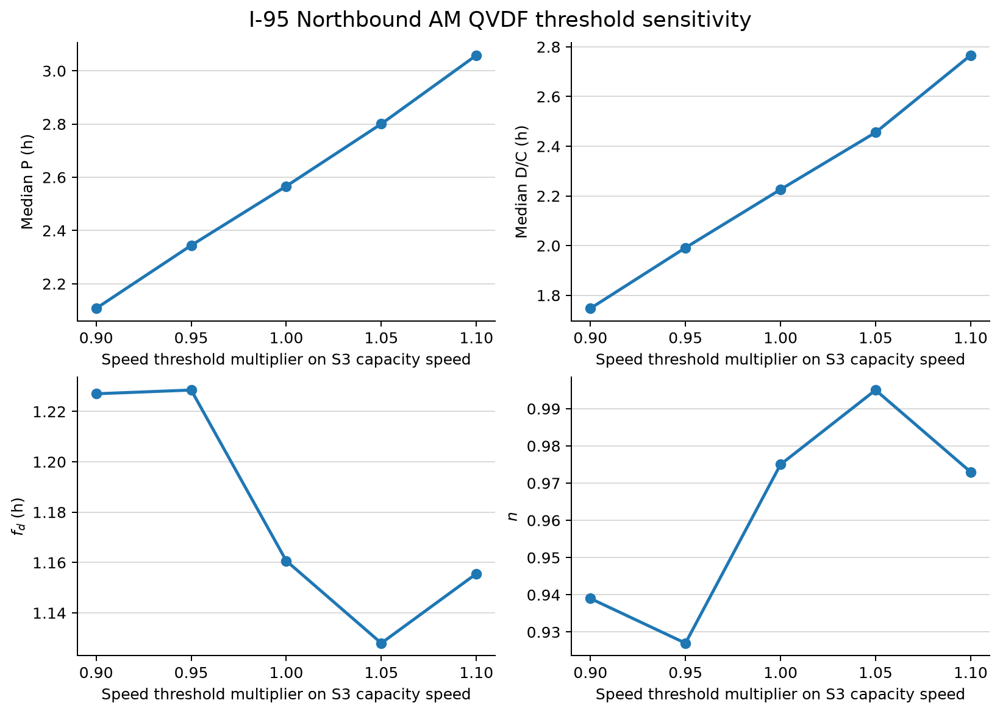

# NVTA Experiment A: I-95 Northbound AM

## Purpose

This run transfers the PeMS threshold-sensitivity structure to the NVTA/RITIS data. The additional step is the reconstruction of flow from observed speed with the existing inverse S3 fundamental diagram.

The experiment asks whether changing the congestion speed threshold materially changes the fitted QVDF duration parameters in

$$
P_r=f_{d,r}\left(\frac{D}{C}\right)_r^{n_r}.
$$

The subscript \(r\) is important: \(P\), \(D/C\), \(f_d\), and \(n\) are recalculated for every tested threshold.

## Scope

- Dataset: NVTA INRIX/RITIS five-minute speed observations
- Dates: 23 weekdays, October 1-31, 2025
- Corridor and direction: I-95 northbound
- Analysis period: AM, with the episode trough between 05:00 and 10:00
- Analysis interval: 15 minutes, aggregated from the five-minute source
- Facilities retained: 20 GP TMCs and 14 northbound HOV/managed-lane TMCs
- Thresholds: \(0.90\), \(0.95\), \(1.00\), \(1.05\), and \(1.10\) times the S3 speed at capacity
- Episode rule: centered three-bin mean, 30-minute recovery hysteresis, minimum duration 0.5 hour

## Fixed S3 inputs

The run uses the same speed-only INRIX priors as the earlier NVTA QVDF workflow:

| Facility | \(v_f\) | \(C\) per lane | \(m\) | \(v_c=v_f2^{-2/m}\) |
|---|---:|---:|---:|---:|
| GP | 70 mph | 2,200 veh/h/lane | 4 | 49.50 mph |
| HOV | 65 mph | 1,800 veh/h/lane | 4 | 45.96 mph |

For each 15-minute speed observation,

$$
k(v)=k_c\left[\left(\frac{v_f}{v}\right)^{m/2}-1\right]^{1/m},
\qquad
q_{\mathrm{lane}}(v)=k(v)v.
$$

The whole-link quantities are

$$
q_{\mathrm{link}}(t)=q_{\mathrm{lane}}(t)N,
\qquad
D_r=\sum_{t\in\mathcal{E}_r}q_{\mathrm{link}}(t)\Delta t,
\qquad
C_{\mathrm{link}}=C_{\mathrm{lane}}N.
$$

Therefore,

$$
\left(\frac{D}{C}\right)_r=\frac{D_r}{C_{\mathrm{link}}}\quad [\mathrm{h}].
$$

The S3 parameters remain fixed during the threshold sweep. The QVDF duration parameters do not: each threshold receives a separate fitted pair \((f_{d,r},n_r)\).

## Common-support rule

The sensitivity comparison uses the same TMC-day observations at all five thresholds. A TMC-day enters the fit only when it has a positive, uncensored AM episode at every threshold.

- I-95 NB GP: 276 common-support TMC-days across all 20 TMCs
- I-95 HOV NB: 2 common-support TMC-days across 2 TMCs

The HOV sample is not fitted because two observations cannot support a defensible two-parameter duration curve. Its lack of recurring AM congestion is retained as a result rather than repaired by pooling it with GP lanes.

## GP sensitivity results

| Threshold multiplier | Median \(P\) (h) | Median \(D/C\) (h) | \(f_d\) | \(n\) | \(R^2\) | RMSE (h) |
|---:|---:|---:|---:|---:|---:|---:|
| 0.90 | 2.107 | 1.747 | 1.227 | 0.939 | 0.948 | 0.241 |
| 0.95 | 2.344 | 1.992 | 1.228 | 0.927 | 0.948 | 0.245 |
| 1.00 | 2.567 | 2.226 | 1.161 | 0.975 | 0.959 | 0.266 |
| 1.05 | 2.801 | 2.455 | 1.128 | 0.995 | 0.959 | 0.306 |
| 1.10 | 3.058 | 2.766 | 1.156 | 0.973 | 0.974 | 0.314 |

Relative to \(1.00v_c\), \(f_d\) changes by at most 5.8% and \(n\) by at most 4.9%. The fitted relationship remains strong at all five thresholds. Increasing the threshold predictably increases both the detected duration and capacity-equivalent congestion volume, but it does not materially change the fitted exponent.



## Interpretation

For I-95 northbound GP lanes in the AM period, the QVDF duration parameters are reasonably stable around the S3 speed at capacity. This supports the claim that the duration relationship is not being created by one exact cutoff choice within the tested range.

The managed-lane finding is different: the open northbound HOV facility is usually uncongested during the AM period, leaving only two TMC-days that remain congested at all five thresholds. This is useful evidence for the managed-lane reliability question, but it is not enough evidence to estimate a managed-lane \(f_d,n\) curve.

## Reproduction

Run from the repository root:

```bash
python scripts/run_nvta_experiment_a.py
```

The script reads the local full-October RITIS source in chunks. The raw observations are not copied into this public repository. The configuration records the expected local source and mapping paths.

