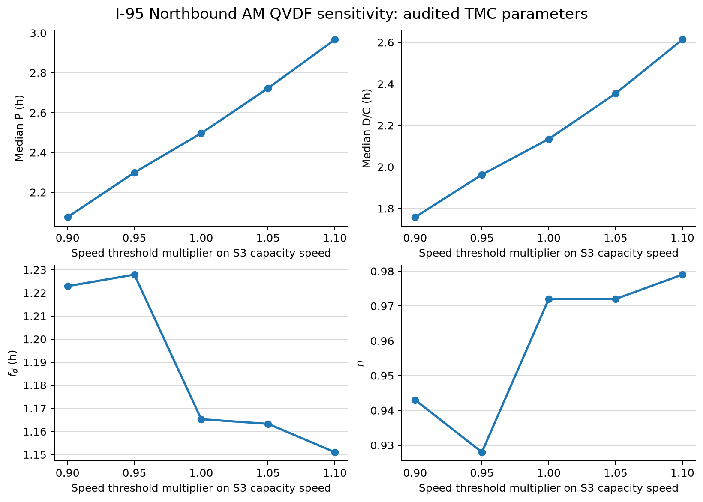

# NVTA Experiment A v2: Audited TMC Parameters

## Purpose

This run repeats the I-95 northbound AM threshold-sensitivity experiment while
replacing the inherited facility-wide free-flow-speed and capacity constants.
It changes only the fixed S3 inputs. The episode rule, threshold multipliers,
common-support rule, and QVDF fitting method remain unchanged from the legacy
run.

## Parameter definitions

For each TMC $s$, the empirical free-flow-speed estimate is

$$
v_{f,s}=Q_{0.85}\left(
\left\{v_{s,d,t}:d\text{ is a weekday},\ 
t\in[00{:}00,05{:}00)\cup[21{:}00,24{:}00)
\right\}
\right).
$$

The sample contains the 23 weekdays in October 2025. Each TMC receives its own
$v_f$ before the AM threshold sweep begins. These off-peak observations are not
part of the 05:00-10:00 AM episode window.

Capacity comes from the matched Cube AM network:

$$
c_s=\texttt{IAMHRLNCAP}_s,
\qquad
C_s=c_sL_s=\texttt{IAMHRLKCAP}_s,
$$

where $c_s$ is in veh/h/lane, $L_s$ is the network lane count, and $C_s$ is in
veh/h/link. The S3 shape parameter remains fixed at $m=4$ for both facilities.

| Facility | TMCs | $v_f$ range (mph) | Median $v_f$ (mph) | $c$ range (veh/h/lane) | Median $C$ (veh/h/link) |
|---|---:|---:|---:|---:|---:|
| GP | 20 | 65.99-72.38 | 70.20 | 1,900-2,000 | 7,600 |
| HOV/managed | 14 | 69.77-73.00 | 71.00 | 2,000 | 6,000 |

## GP threshold-sensitivity results

| Threshold multiplier on $v_c$ | Common TMC-days | Median $P$ (h) | Median $D/C$ (h) | $f_d$ | $n$ | $R^2$ | RMSE (h) |
|---:|---:|---:|---:|---:|---:|---:|---:|
| 0.90 | 275 | 2.075 | 1.758 | 1.223 | 0.943 | 0.948 | 0.236 |
| 0.95 | 275 | 2.299 | 1.963 | 1.228 | 0.928 | 0.948 | 0.245 |
| 1.00 | 275 | 2.496 | 2.134 | 1.165 | 0.972 | 0.959 | 0.264 |
| 1.05 | 275 | 2.723 | 2.354 | 1.163 | 0.972 | 0.955 | 0.284 |
| 1.10 | 275 | 2.967 | 2.613 | 1.151 | 0.979 | 0.966 | 0.308 |

Relative to the $1.00v_c$ case, $f_d$ changes by at most 5.4% and $n$ by at
most 4.5%. The fitted relationship remains strong at every threshold, with
$R^2$ from 0.948 to 0.966. The audited parameters therefore preserve the main
legacy finding: the fitted GP duration relationship is stable around the S3
capacity speed.



## Managed-lane result

Only three HOV/managed-lane TMC-days remain on common support across all five
thresholds. This is below the minimum sample of ten, so the run does not fit a
managed-lane $f_d,n$ curve. The result reflects weak recurring AM congestion in
the selected northbound managed-lane sample.

## Reproduction

Run from the repository root:

```bash
python scripts/audit_nvta_i95_parameters.py
python scripts/run_nvta_experiment_a.py \
  --config config/nvta_experiment_a_i95_nb_am_empirical.json
```

The audit produces the per-TMC parameter inputs. The v2 configuration writes
files with the `nvta_a_v2` prefix, leaving the legacy outputs intact.

## Classification item for review

TMC `110+04150` is labeled GP in the corridor mapping but maps to a network row
with the same AM-open/PM-closed reversible restriction codes used by the HOV
links. It remains in this controlled rerun so the only intended change is the
parameter definition. It should be verified, reclassified, or excluded before
a final GP-versus-managed-lane comparison.
