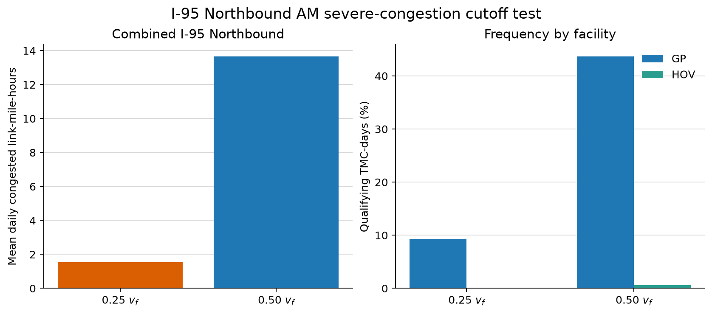

# NVTA B1 Speed-Cutoff Test

## Question

The current severe-congestion threshold corresponds to a travel-time ratio of
2.0, or a speed ratio of 0.50. The proposed stricter case uses a travel-time
ratio of 4.0, or a speed ratio of 0.25. This test measures how that change
affects I-95 northbound AM congested duration.

## Scope

- Dataset: NVTA INRIX/RITIS five-minute speed observations
- Dates: 23 weekdays, October 1-31, 2025
- Corridor: I-95 northbound GP and HOV/managed lanes
- Episode trough window: 05:00-10:00
- Analysis resolution: 15 minutes
- Free-flow speed: each TMC's weekday off-peak observed-speed P85
- Capacity: matched Cube AM network capacity

For TMC $s$ and speed ratio $r$,

$$
v_{\mathrm{cut},s,r}=r v_{f,s},
\qquad r\in\{0.25,0.50\}.
$$

The existing episode rule is retained: a centered three-bin mean, 30-minute
recovery hysteresis, minimum duration of 0.5 hour, and the longest qualifying
AM episode. Let $P_{s,d,r}$ be its duration and $L_s$ the TMC length. The daily
B1-style observed measure is

$$
B1_{d,r}=\sum_s P_{s,d,r}L_s
\qquad [\mathrm{link\text{-}mile\text{-}hours}].
$$

## Results

### Combined GP and managed lanes

| Speed cutoff | Median cutoff speed | Qualifying TMC-days | Share of TMC-days | Total link-mile-hours | Mean daily link-mile-hours | Change from $0.50v_f$ |
|---:|---:|---:|---:|---:|---:|---:|
| $0.50v_f$ | 35.40 mph | 203 of 782 | 25.96% | 314.27 | 13.66 | reference |
| $0.25v_f$ | 17.70 mph | 43 of 782 | 5.50% | 35.51 | 1.54 | -88.70% |

### Facility detail

| Facility | Speed cutoff | Qualifying TMC-days | Share | Qualifying TMCs | Mean daily link-mile-hours |
|---|---:|---:|---:|---:|---:|
| GP | $0.50v_f$ | 201 of 460 | 43.70% | 20 | 13.63 |
| GP | $0.25v_f$ | 43 of 460 | 9.35% | 18 | 1.54 |
| HOV/managed | $0.50v_f$ | 2 of 322 | 0.62% | 2 | 0.03 |
| HOV/managed | $0.25v_f$ | 0 of 322 | 0.00% | 0 | 0.00 |



## Interpretation

The $0.25v_f$ threshold isolates only the most severe low-speed observations.
For this corridor and period, it removes 88.7% of the congested
link-mile-hours identified at $0.50v_f$. The managed lane is almost always
unqualified at either cutoff.

The stricter cutoff therefore changes the scale of B1 materially. It may avoid
counting predictable moderate recurring congestion as unreliability, but it
also creates a sparse measure and may produce many zero values in project
comparisons. The observed result supports testing an intermediate cutoff before
recommending $0.25v_f$ as the sole replacement.

This test evaluates the B1 duration measure. It does not refit $f_d$ and $n$;
the separate Experiment A v2 evaluates parameter stability around the S3
capacity speed.

## Reproduction

Run from the repository root:

```bash
python scripts/run_nvta_b1_speed_cutoff.py
```

The script writes the TMC-day episode table, the daily link-mile-hour table,
the compact summary, and the comparison figure without overwriting Experiment
A outputs.
